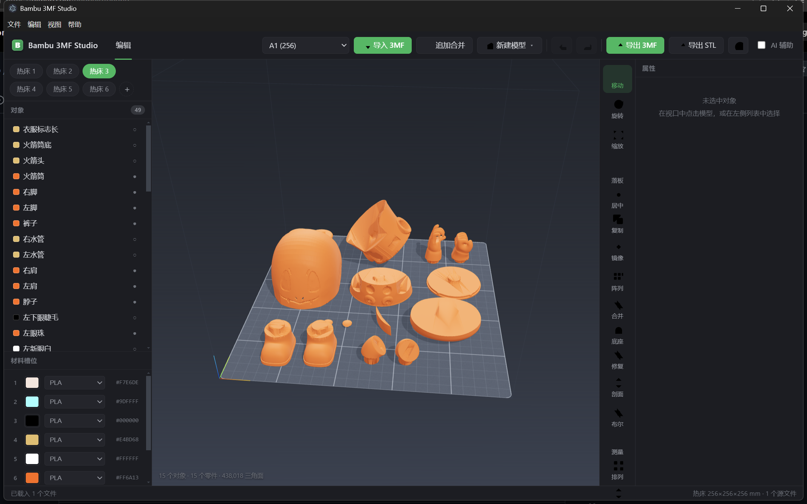

# z3d · Bambu 3MF Studio

一个用于**修改拓竹（Bambu Lab）3MF 项目文件**的桌面编辑器。支持预览模型、修改形状大小与颜色、同时打开多个 3MF 进行组合、并导出能被 Bambu Studio 正常打开的 3MF 文件（保留全部拓竹私有元数据）。

界面参考 Bambu Studio 布局，使用绿色主题。

<p align="center">
  
</p>

---

## 功能特性

- **Bambu 多盘仿真**：解析 `model_settings.config` 中的 `<plate>`，自动还原 1~6 个热床；每个热床独立显示其对象，点击左侧热床标签切换
- **热床可视化**：圆角磨砂打印盘 + 10/50mm 格子纹理，自动跟随当前热床对象的实际位置移动
- **3D 预览**：Three.js WebGL 渲染，Z-up 坐标系（与切片器一致），按需渲染（静止时 GPU 零占用）
- **形状编辑**：移动 / 旋转 / 缩放，支持整体缩放联动与按轴尺寸修改；落板 / 居中 / 自动排列
- **建模运算**：布尔（并/交/差）、修复、切割、镜像、阵列、拆分、合并 —— 基于 `three-bvh-csg`
- **颜色编辑**：整体换色 + 按零件分色，映射到拓竹料槽 `filament_id`；料槽颜色可自由编辑、增删
- **AI 辅助修改**（默认关闭）：本地 token-gated HTTP 服务，外部 AI 可通过自然语言指令控制软件修改模型
- **新建基础形状**：无需导入文件，可直接创建立方体 / 圆柱体 / 球体 / 圆锥 / 棱锥 / 圆环，自动落板居中
- **多文件组合**：导入的模型并入同一场景，追加合并其它 3MF
- **保真导出**：以首个导入文档为模板重写几何与配置，其余 ZIP 条目原样保留 —— Bambu Studio 可正常打开
- **撤销 / 重做**：轻量快照，`Ctrl+Z` / `Ctrl+Shift+Z`
- **桌面套壳**：Electron 内置 HTTP 服务托管构建产物，提供原生「打开 / 追加 / 导出」菜单

---

## 技术架构

```
3MF (ZIP)
  ├─ 3D/3dmodel.model        主模型（build / object / components）
  ├─ 3D/Objects/object_N.model  拆分几何（mesh）
  └─ Metadata/
       ├─ model_settings.config     拓竹私有：料槽 / 对象设置 / 多盘 <plate>
       └─ project_settings.config   拓竹私有：热床 / 打印机预设
```

| 层 | 技术 | 说明 |
|---|---|---|
| 解析层 | 字符级扫描 + `TypedArray` | 不依赖 DOMParser，百万面模型不吃内存，解析性能不受 DOM 影响；已修复早期 O(n²) 扫描问题 |
| 导出层 | `fflate` ZIP 重写 | 保留原始私有元数据，仅替换几何 / 配置条目 |
| 视图层 | Three.js | Z-up、OrbitControls、TransformControls、选中框、变换 gizmo、Bambu 风格热床 |
| UI 层 | 原生 DOM + Bambu 深色主题 | 对象树 / 热床标签 / 属性面板 / 料槽 / 右侧工具栏 |
| 建模层 | `three-bvh-csg` | 布尔、修复、切割、镜像、阵列、拆分 |
| 套壳层 | Electron (CJS 主进程) | 内置 HTTP 服务 + 原生菜单，零双份逻辑 |

**关键实现决策**

- 3MF 的 4×3 transform 是行主序行向量约定，与 Three.js 列主序之间自动转置
- 多文件组合以第一个文档为基底，追加对象并默认自动排列避免重叠
- 撤销重做采用全量状态快照，几何共享引用以节省内存
- 阴影按需刷新：大模型只在场景变化时重算 shadow map，避免静态时 GPU 空转

---

## 快速开始

### 环境要求

- Node.js ≥ 18
- 操作系统：Windows / macOS / Linux（Electron 套壳跨平台）

### 安装依赖

```bash
cd bambu3mf-studio
npm install
```

### 开发模式（浏览器）

```bash
npm run dev
# 打开 http://localhost:5180/
```

### 构建生产包

```bash
npm run build          # 产物输出到 dist/
```

### 桌面应用（Electron）

```bash
npm run electron       # 先 build，再启动 Electron 套壳
# 或一步到位：
npm run electron:build
```

> 无 GPU / 远程桌面等环境中若 Electron 启动失败，可强制软件渲染：
> ```bash
> set BAMBU_ELECTRON_DISABLE_GPU=1   # Windows
> npm run electron
> ```

---

## 使用说明

1. **导入 / 新建**：
   - 点击左上角「导入 3MF」选择 `.3mf` 文件
   - 点击「新建模型」选择基础形状（立方体 / 圆柱体 / 球体 / 圆锥 / 棱锥 / 圆环），从零开始建模
   - 「追加合并」可继续叠加其它 3MF
2. **热床切换**：左侧「热床 1 ~ 热床 N」标签切换；热床自动移动到对应盘对象的下方并重新构图
3. **选中**：在左侧对象树单击对象；多零件对象可下钻到零件；支持显示 / 隐藏
4. **编辑**：
   - 顶部工具栏切换 **移动 / 旋转 / 缩放** 模式，场景中拖拽 gizmo
   - 右侧属性面板精确输入 **位置 / 旋转 / 尺寸 / 缩放**
   - 快捷键：落板、居中、复制（`Ctrl+D`）、自动排列、删除
5. **建模运算**：右侧工具栏选择布尔（并/交/差）、修复、切割、镜像、阵列、拆分、合并
6. **改色**：右侧属性面板「颜色 / 料槽」区选择料槽并改色；料槽与拓竹 `filament_id` 对应
7. **导出**：点击「导出 3MF」，下载的 `.3mf` 可直接用 Bambu Studio 打开

---

## AI 辅助控制

默认关闭。开启后，编辑器会在本地 `127.0.0.1:5199` 启动一个带一次性 token 的 HTTP 服务，外部 AI 代理可 POST 自然语言命令控制软件。

```bash
# 示例
POST http://127.0.0.1:5199/command
{"token":"<面板中显示的token>","command":{"cmd":"move","args":{"objectName":"头部","x":10,"y":20}}}
```

支持指令包括：选择对象、移动、旋转、缩放、镜像、阵列、布尔、修复、切割、改色、导出等。详情见 `src/core/ai-bridge.js`。

---

## npm 脚本

| 脚本 | 作用 |
|---|---|
| `npm run dev` | 启动 Vite 开发服务器 |
| `npm run build` | 构建生产包到 `dist/` |
| `npm run preview` | 预览生产构建 |
| `npm run sample` | 生成样例 3MF（`samples/`） |
| `npm run test` | 生成样例 + 运行端到端回归测试（228 项） |
| `npm run electron` | 启动 Electron 套壳（需先 build） |
| `npm run electron:build` | build + 启动 Electron 套壳 |
| `npm run pack` | 使用 electron-builder 打包安装程序 |
| `npm run dist` | build + 打包安装程序 |

---

## 测试

```bash
npm test
```

`tools/test-roundtrip.mjs` 覆盖读 → 改 → 写 → 再读的多项断言：几何无损、transform 往返一致、料槽颜色保持、组合件零件偏移保持、三角面总数无损、新建基础形状导出回读、布尔/修复、AI 桥、大文件解析性能、多盘解析与显示等。

导出文件可用 `tools/verify-export.mjs` 单独回读校验：

```bash
node tools/verify-export.mjs path/to/exported.3mf
```

---

## 项目结构

```
bambu3mf-studio/
├─ index.html                 # UI 骨架（顶栏 / 对象树 / 视口 / 属性 / 状态栏）
├─ src/
│  ├─ main.js                 # 主控 App：工具栏 / 键盘 / 导入 / 编辑 / 导出
│  ├─ style.css               # Bambu 风格主题
│  ├─ core/                   # 解析 / 导出 / 历史 / 项目模型
│  │  ├─ threemf/             # archive / model-parser / bambu-config / reader / writer
│  │  ├─ fast-scan.js         # 高性能字符级 XML 扫描
│  │  ├─ project.js           # Project / SceneObject / ScenePart，多盘管理
│  │  ├─ ops.js               # 布尔 / 修复 / 切割等建模运算
│  │  ├─ ai-bridge.js         # 自然语言指令解析与命令桥
│  │  └─ history.js           # 撤销 / 重做
│  ├─ viewer/                 # viewer.js（Three.js 渲染）/ plate.js（热床）
│  └─ ui/                     # tree / inspector / filaments / dom
├─ electron/
│  ├─ main.cjs                # CJS 主进程：HTTP 服务 + BrowserWindow + 原生菜单 + AI 服务
│  ├─ launch.cjs              # 启动器：处理 ELECTRON_RUN_AS_NODE 退化 + 安全标志
│  └─ preload.cjs             # 安全 preload 桥
└─ tools/                     # make-sample / test-roundtrip / verify-export
```

---

## 常见问题

**Q：Electron 启动报 `app is not a function` / GPU process 崩溃？**
A：本机若被全局注入 `ELECTRON_RUN_AS_NODE=1`，会让 electron 退化成 node。本项目 `electron/launch.cjs` 已自动清除该变量；无 GPU 环境再设 `BAMBU_ELECTRON_DISABLE_GPU=1` 强制软件渲染。

**Q：同时启动多个 Electron 实例后看不到窗口？**
A：多个实例会争抢 5188 端口，只有第一个抢到端口的实例能建出窗口。请先结束所有 `electron.exe` 进程（或重启电脑），再启动一次。

**Q：导出文件在 Bambu Studio 打不开？**
A：本编辑器以首个导入文档为模板保真导出，理论上完全兼容。若遇异常，多半是源文件本身私有字段异常，可反馈具体文件。

**Q：导入超大模型会卡吗？**
A：解析层用字符级扫描 + TypedArray，不生成大量 DOM 节点；按需渲染只在场景变化时绘制。百万面模型在普通独显上可流畅查看。

---

## 路线图

- [ ] 装配体层级编辑与嵌套组合
- [x] 切割 / 布尔运算
- [ ] 支撑与切片预览
- [x] 多盘热床仿真与切换
- [ ] 安装包分发（`electron-builder` 已配置，待正式 CI 构建）
- [ ] 多语言（中英切换）

---

## License

内部工具，按需使用。
